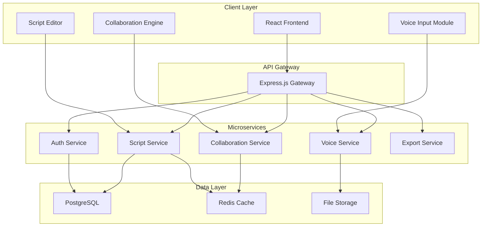

# Design Document

## Overview

The Voice Script Editor is a modern web application built with a React frontend, Node.js backend, and real-time collaboration capabilities. The system architecture prioritizes performance, scalability, and seamless voice integration while maintaining professional screenwriting standards. The application uses a microservices approach with dedicated services for authentication, script management, voice processing, and real-time collaboration.

## Architecture

### High-Level Architecture



### Technology Stack

**Frontend:**
- React 18 with TypeScript for type safety and modern development
- Tailwind CSS for responsive design and dark mode support (dark theme as primary)
- Custom CSS for screenplay formatting and industry-standard layout
- React Query for efficient data fetching and caching
- Socket.io-client for real-time collaboration
- Web Speech API for voice input with fallback to cloud services
- Framer Motion for smooth animations and transitions (voice button pulsing, mode switching)
- Custom color palette: Dark backgrounds (#1F2937, #111827) with gold/amber accents (#F59E0B)

**Backend:**
- Node.js with Express.js for API gateway and routing
- TypeScript for consistent type safety across the stack
- Socket.io for real-time collaboration features
- JWT for secure authentication and session management
- Bull Queue for background job processing (exports, reports)

**Database:**
- PostgreSQL for primary data storage with JSONB for flexible script content
- Redis for session management, caching, and real-time collaboration state
- AWS S3 or similar for file storage (exports, imports, media)

**Infrastructure:**
- Docker containers for consistent deployment
- NGINX for load balancing and static file serving
- WebSocket connections for real-time features
- CDN for global content delivery

## UI Design System

### Modern Visual Design Language

**Advanced Color System**
- Adaptive color palette that adjusts based on time of day and user preference
- Primary: Deep charcoal (#0F172A) with subtle blue undertones
- Surface: Elevated surfaces with glass-morphism effects (#1E293B with 80% opacity)
- Accent: Dynamic gradient system (Purple-to-blue for primary actions, warm orange for voice)
- Semantic colors: Context-aware colors that change based on content type
- High contrast mode support with WCAG AAA compliance

**Progressive Typography**
- Variable font system (Inter Variable) for optimal rendering at all sizes
- Fluid typography that scales smoothly across devices
- Content-aware font selection: Serif for long-form reading, sans-serif for UI
- Advanced OpenType features: Ligatures, contextual alternates
- Reading mode with optimized line length and spacing

**Responsive Design System**
- Mobile-first approach with progressive enhancement for larger screens
- Breakpoint system: 320px (mobile), 768px (tablet), 1024px (laptop), 1366px (desktop), 1920px (large)
- Fluid spacing system based on viewport units and content density
- Container queries for component-level responsiveness
- Adaptive grid system that responds to content and screen size
- Touch-first interactions with hover states for pointer devices
- Orientation-aware layouts for portrait and landscape modes

**Next-Generation Interactive Elements**
- Haptic feedback integration for supported devices
- Voice-first design with visual elements that support, not dominate
- Gesture-based navigation with swipe patterns and pinch-to-zoom
- Contextual floating action buttons that appear based on user intent
- Smart suggestions and predictive UI elements
- Seamless mode transitions with shared element animations

### Responsive Screen Layouts

**Mobile Dashboard (320px-768px)**
- Bottom tab navigation with large touch targets
- Single-column script list with swipe actions for quick operations
- Floating action button for creating new scripts
- Pull-to-refresh functionality for script updates
- Simplified header with hamburger menu for settings

**Tablet Dashboard (768px-1024px)**
- Two-column layout: sidebar navigation + main content area
- Grid view for scripts with larger cards optimized for touch
- Split-screen capability for viewing script details
- Gesture-based navigation with swipe between sections
- Adaptive keyboard shortcuts when external keyboard detected

**Desktop Dashboard (1024px+)**
- Three-column layout: navigation, script grid, preview/details panel
- Masonry-style script grid that adapts to content length and screen size
- Smart script cards with contextual actions revealed on hover/focus
- Command palette (Cmd+K) for quick navigation and actions
- Multiple workspace support with tabbed interface

**Responsive Script Editor**

**Mobile Editor (320px-768px)**
- Full-screen editor with collapsible bottom toolbar
- Swipe gestures to access scenes and elements panels
- Large voice input button optimized for thumb reach
- Simplified formatting toolbar with essential tools only
- Auto-hide UI during active writing with tap to reveal

**Tablet Editor (768px-1024px)**
- Two-panel layout: collapsible sidebar + main editor
- Floating toolbar that adapts to screen orientation
- Split-screen mode for comparing drafts side-by-side
- Touch-optimized voice controls with haptic feedback
- Adaptive keyboard shortcuts when external keyboard connected

**Desktop Editor (1024px+)**
- Three-panel layout: scenes/elements sidebar, main editor, optional notes panel
- Floating toolbar that follows cursor and provides contextual formatting
- Multiple document tabs for working on several scripts simultaneously
- Advanced keyboard shortcuts and power-user features
- Zen mode: Full-screen writing with minimal UI and focus indicators

**Intelligent Start Experience**
- Onboarding flow that adapts to user's experience level
- Template selection with live previews and smart recommendations
- Voice calibration integrated into the setup flow
- Progressive feature introduction based on user behavior
- Quick start options with one-click project creation
- Contextual help that appears when needed, disappears when not

**Advanced Interaction Patterns**
- Gesture-based navigation: Swipe between scenes, pinch to zoom
- Voice-activated UI: "Show character panel", "Switch to dark mode"
- Smart auto-complete that learns from user's writing style
- Contextual menus that appear based on selected content
- Floating panels that can be repositioned and resized
- Keyboard-first design with comprehensive shortcut system

### Innovative UI Features

**AI-Powered Simplification**
- Smart UI that hides complexity until needed
- Predictive interface that surfaces relevant tools based on writing context
- Automatic layout optimization based on user behavior patterns
- Intelligent content organization that suggests scene breaks and character arcs
- Context-aware help system that provides just-in-time guidance

**Voice-First Design Philosophy**
- Visual elements designed to complement, not compete with voice input
- Minimal visual noise during voice dictation sessions
- Audio-first feedback with visual confirmation as secondary
- Voice command discovery through natural language exploration
- Seamless transition between voice and visual interaction modes

**Adaptive Complexity**
- Beginner mode: Simplified interface with guided workflows
- Professional mode: Full feature set with advanced customization
- Context-sensitive UI that shows relevant features based on current task
- Progressive disclosure: Features unlock as users demonstrate proficiency
- Customizable workspace that remembers user preferences and adapts over time

**Modern Accessibility**
- Voice control as primary accessibility feature, not an add-on
- High contrast mode with customizable color schemes
- Keyboard navigation that rivals mouse interaction
- Screen reader optimization with semantic HTML and ARIA labels
- Reduced motion options for users with vestibular disorders
- Cognitive accessibility features: simplified language, clear visual hierarchy

## Components and Interfaces

### Frontend Components

#### Core Layout Components

**AppShell**
- Top navigation bar with "ScriptEase" branding and user profile avatar (top-right)
- Settings icon and help icon in header for quick access
- Dark theme with warm gold/amber accent colors (#F59E0B) for primary actions
- Responsive layout that adapts to mobile and desktop viewports

**Dashboard**
- "Your Scripts" section displaying script cards with titles, descriptions, and "Edited X ago" timestamps
- Each script card shows character avatars (small circular icons) indicating collaborators
- "Start a New Script" card with dashed border and plus icon at bottom of grid
- Clean card-based layout with subtle shadows and rounded corners
- Search functionality integrated into the header area

**ScriptEditor**
- Left sidebar with collapsible sections:
  - "SCENES" panel showing numbered scene list (Scene 1, Scene 2, etc.)
  - "ELEMENTS" section with tabs for Characters, Locations, Props
  - Character names (ANNA, MARK) and location names displayed in sidebar
- Main editor area with:
  - Scene heading format: "INT. COFFEE SHOP - DAY" 
  - Proper screenplay formatting with character names centered and dialogue indented
  - Clean typography with adequate line spacing
- Bottom-center voice input button (large circular microphone icon with gold/amber color)
- "Talk" and "Write" mode toggle buttons prominently displayed

#### Voice Integration Components

**VoiceInputManager**
- Large circular microphone button with gold/amber color (#F59E0B) positioned at bottom-center
- Visual feedback: button pulses and changes color when actively listening
- "Talk" mode button in top-left toggles voice input mode
- Microphone icon shows listening state with subtle animation
- Error states display with red color and appropriate messaging

**VoiceCommandProcessor**
- Seamless integration with script editor for voice-to-text conversion
- Context-aware formatting: automatically detects scene headings, character names, dialogue
- Visual confirmation of recognized text with subtle highlighting
- Voice command feedback integrated into the main editor interface

**StartScreen**
- Clean centered layout with "Start Your Script" heading
- "Switch between talk and write modes to begin" subtitle
- Large "Talk" button (gold/amber) and "Write" button (dark) side by side
- Prominent microphone icon below the mode selection buttons
- Minimalist design matching the overall application aesthetic

#### Script Management Components

**ScriptFormatter**
- Applies industry-standard formatting rules automatically
- Handles character names, scene headings, dialogue, and action lines
- Manages page breaks, scene numbering, and continued dialogue
- Provides template-based formatting for different script types

**ElementsPanel**
- Manages characters, locations, and props databases
- Provides quick insertion and reference tools
- Shows element usage statistics and scene associations
- Handles element consistency checking across scripts

### Backend Services

#### Authentication Service

**UserController**
- Handles user registration, login, and password reset
- Manages JWT token generation and validation
- Provides user profile management and preferences
- Handles cross-device session synchronization

**AuthMiddleware**
- Validates JWT tokens on protected routes
- Manages session expiration and refresh logic
- Provides role-based access control for collaboration
- Handles rate limiting and security measures

#### Script Service

**ScriptController**
- Manages CRUD operations for scripts and projects
- Handles draft creation and version management
- Provides script search and filtering capabilities
- Manages script sharing and collaboration permissions

**ScriptModel**
- Defines database schema for scripts with JSONB content storage
- Handles version tracking and change history
- Manages relationships between scripts, characters, locations, and props
- Provides efficient querying for large script collections

#### Voice Service

**VoiceProcessor**
- Integrates with speech-to-text APIs (mock implementation for MVP)
- Handles voice command interpretation and formatting
- Manages voice settings and user-specific calibration
- Provides error handling and fallback mechanisms

**CommandParser**
- Parses voice commands for script formatting elements
- Maintains context awareness for command interpretation
- Handles custom user command phrases and shortcuts
- Provides disambiguation for ambiguous commands

#### Collaboration Service

**CollaborationManager**
- Manages real-time editing sessions using Socket.io
- Handles conflict resolution for simultaneous edits
- Provides live cursor tracking and user presence indicators
- Manages comment threads and annotation systems

**PermissionManager**
- Controls access levels (view, comment, edit) for shared scripts
- Manages user invitations and collaboration notifications
- Handles permission inheritance for projects and series
- Provides audit trails for collaboration activities

## Data Models

### Core Data Models

```typescript
interface User {
  id: string;
  email: string;
  passwordHash: string;
  profile: {
    name: string;
    avatar?: string;
    preferences: UserPreferences;
  };
  createdAt: Date;
  updatedAt: Date;
}

interface UserPreferences {
  theme: 'light' | 'dark';
  fontSize: number;
  fontFamily: string;
  lineSpacing: number;
  autoSaveInterval: number;
  voiceSettings: VoiceSettings;
}

interface VoiceSettings {
  language: string;
  sensitivity: number;
  customCommands: Record<string, string>;
  microphoneDeviceId?: string;
  noiseReduction: boolean;
}

interface Project {
  id: string;
  userId: string;
  name: string;
  description: string;
  type: 'feature' | 'tv-series' | 'stage-play' | 'short-film';
  scripts: Script[];
  sharedElements: {
    characters: Character[];
    locations: Location[];
    props: Prop[];
  };
  collaborators: Collaborator[];
  createdAt: Date;
  updatedAt: Date;
}

interface Script {
  id: string;
  projectId: string;
  title: string;
  description: string;
  content: ScriptContent;
  currentDraftId: string;
  drafts: Draft[];
  versions: Version[];
  metadata: ScriptMetadata;
  collaborators: Collaborator[];
  createdAt: Date;
  updatedAt: Date;
}

interface ScriptContent {
  scenes: Scene[];
  elements: {
    characters: Character[];
    locations: Location[];
    props: Prop[];
  };
  formatting: FormattingRules;
}

interface Scene {
  id: string;
  heading: string;
  description: string;
  content: ScriptElement[];
  pageNumber: number;
  estimatedDuration: number;
}

interface ScriptElement {
  id: string;
  type: 'scene-heading' | 'action' | 'character' | 'dialogue' | 'parenthetical' | 'transition';
  content: string;
  formatting: ElementFormatting;
  metadata: {
    voiceGenerated: boolean;
    timestamp: Date;
    author: string;
  };
}
```

### Collaboration Models

```typescript
interface Collaborator {
  userId: string;
  role: 'owner' | 'editor' | 'commenter' | 'viewer';
  permissions: Permission[];
  invitedAt: Date;
  lastActive: Date;
}

interface Comment {
  id: string;
  scriptId: string;
  elementId: string;
  author: string;
  content: string;
  thread: CommentReply[];
  resolved: boolean;
  createdAt: Date;
}

interface Version {
  id: string;
  scriptId: string;
  versionNumber: string;
  changes: ChangeSet[];
  notes: string;
  createdBy: string;
  createdAt: Date;
}

interface Draft {
  id: string;
  scriptId: string;
  name: string;
  content: ScriptContent;
  createdFrom?: string;
  createdAt: Date;
}
```

## Error Handling

### Voice Input Error Handling

**Speech Recognition Errors**
- Network connectivity issues: Queue voice input locally, process when connection restored
- Microphone access denied: Provide clear instructions and fallback to keyboard input
- Unsupported browser: Display compatibility message and disable voice features gracefully
- Background noise interference: Provide noise level indicators and adjustment suggestions

**Voice Command Processing**
- Ambiguous commands: Present disambiguation options to user
- Unrecognized commands: Offer suggestions based on context and available commands
- Formatting conflicts: Apply best-guess formatting with undo option
- Context switching errors: Maintain command history and provide correction mechanisms

### Data Persistence Errors

**Auto-save Failures**
- Network interruption: Store changes locally, sync when connection restored
- Server errors: Retry with exponential backoff, notify user of save status
- Concurrent edit conflicts: Present merge options with visual diff comparison
- Storage quota exceeded: Provide cleanup options and upgrade prompts

**Collaboration Errors**
- WebSocket disconnection: Attempt reconnection, show offline status to collaborators
- Permission changes: Gracefully handle access revocation with appropriate notifications
- Sync conflicts: Use operational transformation for conflict resolution
- User presence errors: Maintain last-known state, update when connection restored

## Testing Strategy

### Unit Testing

**Frontend Components**
- Test voice input component state management and error handling
- Verify script formatting logic with various input scenarios
- Test collaboration features with mock WebSocket connections
- Validate theme switching and responsive design behavior

**Backend Services**
- Test authentication flows including JWT generation and validation
- Verify script CRUD operations with database integration
- Test voice command parsing with various input formats
- Validate collaboration permission logic and access control

### Integration Testing

**Voice Integration**
- Test speech-to-text accuracy with sample audio files
- Verify voice command recognition in different contexts
- Test fallback mechanisms when voice services fail
- Validate voice settings persistence across sessions

**Real-time Collaboration**
- Test simultaneous editing scenarios with multiple users
- Verify conflict resolution algorithms with complex changes
- Test comment threading and notification systems
- Validate permission changes during active collaboration sessions

**Cross-device Synchronization**
- Test script synchronization across multiple devices
- Verify offline editing and sync when connection restored
- Test settings and preferences synchronization
- Validate session management across device switches

### End-to-End Testing

**Complete User Workflows**
- Test full script creation workflow from template selection to export
- Verify collaboration invitation and permission management flows
- Test voice input integration throughout the script writing process
- Validate export functionality with various formats and options

**Performance Testing**
- Test application performance with large scripts (100+ pages)
- Verify real-time collaboration performance with multiple concurrent users
- Test voice input responsiveness and accuracy under various conditions
- Validate auto-save performance and data consistency

### Accessibility Testing

**Voice Input Accessibility**
- Test voice input as primary interaction method for users with mobility limitations
- Verify keyboard navigation alternatives for all voice features
- Test screen reader compatibility with voice input feedback
- Validate voice command customization for users with speech variations

**Visual Accessibility**
- Test dark mode contrast ratios and readability
- Verify font size and spacing customization options
- Test color-blind friendly revision color schemes
- Validate responsive design on various screen sizes and orientations